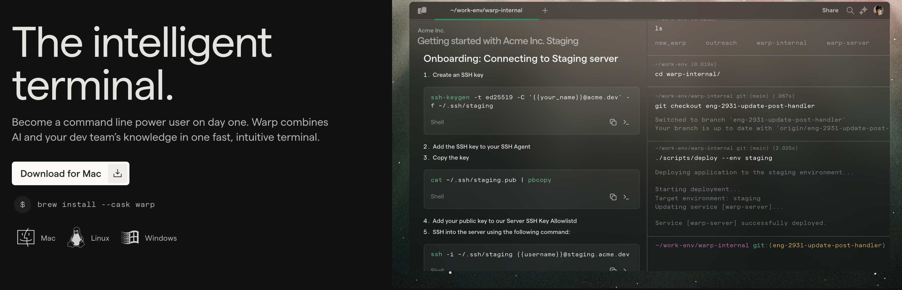
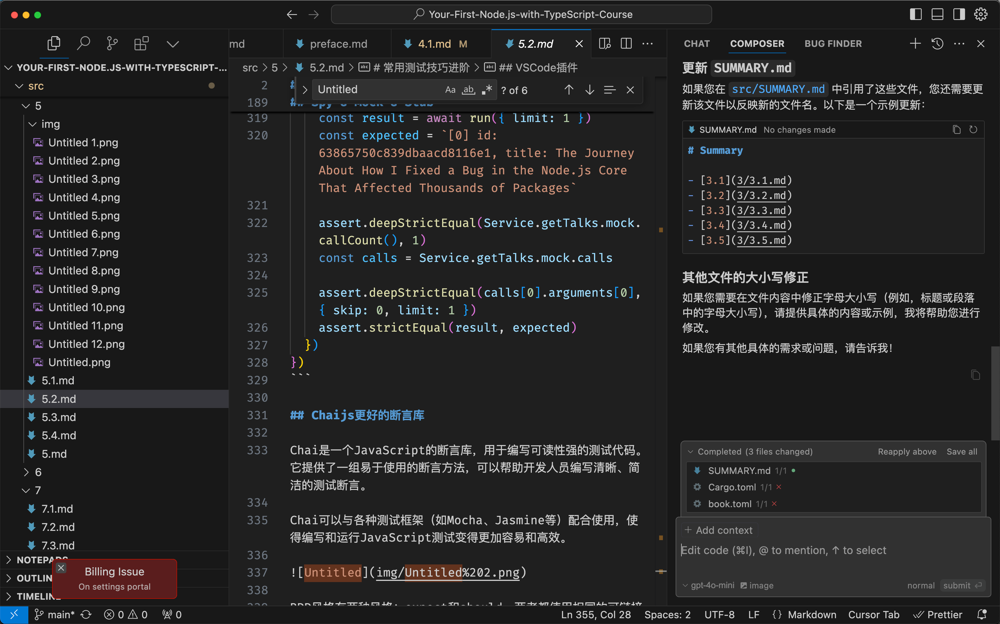

# VSCode必杀技

首先，我们要承认开发是效率差别的，使用VSCode也是，下面列举几个我认为的提效技巧。

1. 使用Warp终端
2. 使用code命令
3. 配置快捷键
4. 使用插件
5. 更好的编辑器Cursor

## 使用Warp终端

Warp 是一个非常强大的终端，它不仅支持多标签，还支持插件，比如我常用的 `git` 插件，可以非常方便的查看 git 提交记录，并且支持模糊搜索。



通常免费的功能就已经非常好用了。

## Code命令


然后在终端中就可以使用了。

```jsx
$ code --install-extension connor4312.nodejs-testing
```

## 配置快捷键

使用快捷键可以提高工作效率、减少手部负担，并提升专注力。因此，在编辑器中使用快捷键是非常推荐的。我是非常习惯XCode快捷键，所以把这套用法也拿到VSCode里，发现还是非常高效的。

keybindings.json

```jsx
// 将键绑定放入此文件中以覆盖默认值
[
    { "key": "cmd+1",           "command": "workbench.view.explorer" },
    { "key": "cmd+2",           "command": "workbench.view.search" },
    { "key": "cmd+3",           "command": "workbench.view.scm" },
    { "key": "cmd+4",           "command": "workbench.view.debug" },
    { "key": "cmd+5",           "command": "workbench.view.extensions" }
]
```

## 必备插件

.vscode/extensions.json 是项目用到的 插件 推荐列表，项目应该将此配置 写入用到的插件


- GitHub Copilot
- GitLens
- Pretty TypeScript Errors
- vscode-icons
- IntelliCode
- nodejs-testing
- wayou.vscode-todo-highlight

## 更好的编辑器Cursor

Cursor 是一个非常强大的 AI 编程工具，它可以帮助你快速生成代码，并且支持多种编程语言。



目前我的绝大部分开发都移到Cursor上，使用的是pro方案。

Cursor是基于VSCode改的，所以上面的插件依然使用，并且也可以在终端里安装cursor命令。

常用功能

- CMD + K 快速生成代码
- CMD + L 打开聊天窗口，composer和bug finder

其他参照VSCode即可。