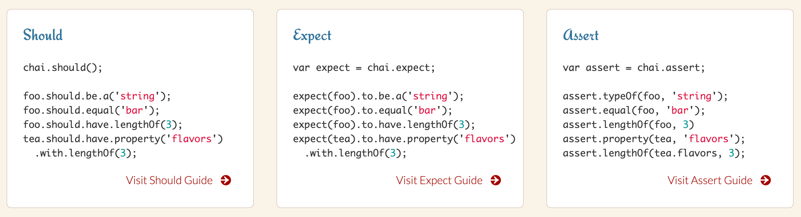
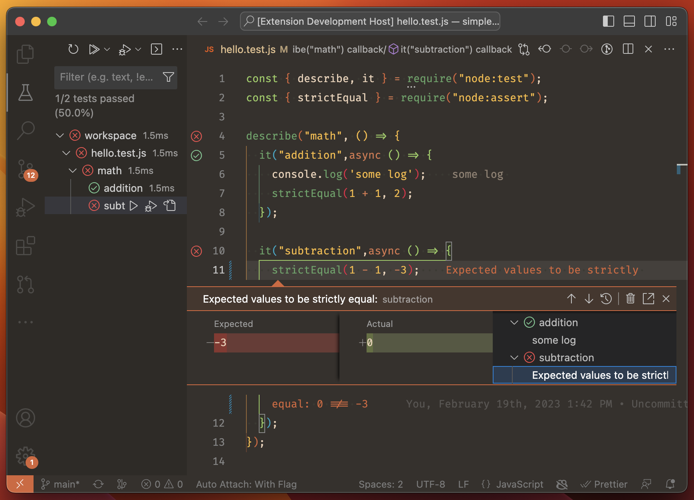

# 常用测试技巧进阶

## 同步和异步

```tsx

describe("test suite", function () {
  it.only("test if works correctly", async function (t) {

  }
})

test('callback passing test', (t, done) => {
  // done() is the callback function. When the setImmediate() runs, it is'k'i'lnvokes
  // done() with no arguments.
  setImmediate(done);
});
```

## 常用技巧

Exclusive && Inclusive其实很好理解，分别对应only和skip函数。这是只有写的test case比较多的时候才会用的简单技巧。(下面代码时正常写法，但在Node.js v20也是直接运行)

```tsx
import { it, describe } from "node:test";
import assert from "node:assert";

import { HelloWorld } from "../src/helloworld";
import { IPerson } from "..";

describe("test suite", function () {
  it.only("test if works correctly", async function (t) {
    const log = t.mock.method(global.console, "log");

    assert.strictEqual(log.mock.callCount(), 0);
    // call hello world say method
    const cli: IPerson = new HelloWorld();
    await cli.sayHi("liangqi");

    assert.strictEqual(log.mock.callCount(), 1);
  });

  it.skip("test if works incorrectly", async function () {
    const cli: IPerson = new HelloWorld();
    assert.rejects(async () => await cli.sayHi(), new Error("fail"));
  });
});

```

上面的代码只会有一个test complete， 只有only的会被执行，另一个会被忽略掉。每个函数里只能有一个only。如果是it.skip ，那么该case就会被忽略。only和skip共用没有什么实际意义，因为only的作用会把skip屏蔽掉。

实际上，Node.js v20里没有按照常规的写法，而是采用了配置参数结合cli的方式。

skip

```tsx
// The skip option is used, but no message is provided.
test('skip option', { skip: true }, (t) => {
  // This code is never executed.
});

// The skip option is used, and a message is provided.
test('skip option with message', { skip: 'this is skipped' }, (t) => {
  // This code is never executed.
});

test('skip() method', (t) => {
  // Make sure to return here as well if the test contains additional logic.
  t.skip();
});

test('skip() method with message', (t) => {
  // Make sure to return here as well if the test contains additional logic.
  t.skip('this is skipped');
});
```

only

```tsx
// Assume Node.js is run with the --test-only command-line option.
// The 'only' option is set, so this test is run.
test('this test is run', { only: true }, async (t) => {
  // Within this test, all subtests are run by default.
  await t.test('running subtest');

  // The test context can be updated to run subtests with the 'only' option.
  t.runOnly(true);
  await t.test('this subtest is now skipped');
  await t.test('this subtest is run', { only: true });

  // Switch the context back to execute all tests.
  t.runOnly(false);
  await t.test('this subtest is now run');

  // Explicitly do not run these tests.
  await t.test('skipped subtest 3', { only: false });
  await t.test('skipped subtest 4', { skip: true });
});

// The 'only' option is not set, so this test is skipped.
test('this test is not run', () => {
  // This code is not run.
  throw new Error('fail');
});
```

参考API文档[https://nodejs.org/api/test.html#testskipname-options-fn](https://nodejs.org/api/test.html#testskipname-options-fn)


有意思的是它竟然加了**`todo`**这个测试，是一个TODO的简写。

## 生命周期

细心的读者应该发现了我们每次在单元测试开始和结束前都需要做一些准备工作，要么是stub函数，要么是准备mock数据。测试框架提供了四个生命周期钩子，我们可以把一些可以复用的准备工作放到钩子中去：

```tsx
describe('test', function() {
  // 在本测试块的所有测试用例之前执行且仅执行一次
  before(function() {

  });
  // 在本测试块的所有测试用例之后执行且仅执行一次
  after(function() {

  });

  // 在测试块的每个测试用例之前执行（有几个测试用例it，就执行几次）
  beforeEach(function() {

  });
  // 在测试块的每个测试用例之后执行（同上）
  afterEach(function() {

  });

  // 测试用例
  it('test item1', function () {

  })
});
```

在下一章节中，我们在写一个Http Server测试的时候就会用到该知识点，需要在before里先启动服务，然后再去跑测试用例。

## TDD vs BDD

BDD（Behaviour Driven Development）是TDD的一种， 倾向于断言被测对象的行为特征而非输入输出。 [Chai](http://chaijs.com/)的BDD风格断言库包括两部分：`expect`和`should`。=

前面所讲的describe, it, before, after等都属于BDD的范畴，对于TDD，Mocha、Ava等测试库都用suite, test, setup, teardown。

```tsx
suite 'Array', !->
    setup !->
        console.log 'setup'
    teardown !->
        console.log 'teardown'
    suite '#indexOf()', !->
        test 'should return -1 when not present', !->
            assert.equal -1, [1,2,3].indexOf 4
```

TDD是测试驱动开发（Test-Driven Development）的缩写。试驱动开发是一种软件开发方法论，其核心思想是在编写实际代码之前，先编写测试代码。

具体的开发流程如下：

1. 编写测试：首先，开发人员编写一个测试用例，描述了预期的功能和行为。这个测试用例会失败，因为实际的代码尚未编写。
2. 运行测试：运行编写的测试用例，确认测试失败。
3. 编写代码：接下来，开发人员编写足够的代码来满足测试用例的要求。
4. 运行测试：再次运行测试用例，确认测试通过。
5. 重构代码：如果测试通过，开发人员可以对代码进行重构，以提高代码的可读性、可维护性和性能。
6. 重复以上步骤：重复上述步骤，编写下一个测试用例，并按照相同的流程编写代码，直到实现所需的功能。

测试驱动开发的优势在于它强调了测试的重要性，并促使开发人员在编写代码之前就思考和定义代码的行为。这有助于提高代码质量、减少bug，并使代码更易于理解和维护。此外，测试驱动开发还可以提高开发效率，因为通过测试用例可以更早地发现问题，并及时进行修复。

重点回顾：

- 先写测试再开发。
- 依循「红灯／绿灯／重构」循环（Red/Green/Refactor）。
- 优点是在初期就确保测试程序的撰写，而且更容易在初期定义出更贴近使用方的接口。

但 TDD 所撰写出来的测试案例是一连串程式码，过于偏重技术人员，不利与其他非技术的项目参与者讨论，例如 PM (Product Manager) 或 PO (Product Owner)。此外，也不利产生一份如下图这样一目了然、容易阅读的测试报告。

TDD更多的是方法论，指导代码编写方式用的。这块可以讲的内容比较多，建议大家去学习一下敏捷开发，来作为补充。

## Spy & Mock & Stub

在软件测试中，stub、mock 和 spy 是三种用于模拟和测试依赖关系的技术。

- Stub **（插桩）**是一种用于在测试过程中替换外部依赖的技术。它的目的是为了在测试中提供所需的输入，并阻止实际的依赖代码被执行。这样，就可以对代码进行单元测试，而无需考虑外部依赖的影响。
- Mock **（伪造）**是一种用于在测试过程中模拟依赖关系的技术。它的目的是为了测试代码的行为，而不是实际的结果。通常，mock 会跟踪依赖代码的调用次数和参数，并根据预期的行为给出响应。
- Spy（**间谍**） 是一种用于在测试过程中监视依赖关系的技术。它的目的是为了测试依赖代码的实际行为，而不仅仅是它的返回值。通常，spy 会跟踪依赖代码的调用次数和参数，并记录下实际执行的行为。

总的来说，stub 和 mock 的目的都是为了在测试中替换依赖关系，但是 mock 更加强调对代码行为的测试，而 stub 更加强调提供测试所需的输入。相比之下，spy 的目的是为了监视依赖关系的。

在Node.js v20中，stub和spy都可以通过mock来实现。

1、mock示例

```tsx
'use strict';
const assert = require('node:assert');
const { mock, test } = require('node:test');

test('spies on a function', () => {
  const sum = mock.fn((a, b) => {
    return a + b;
  });

  assert.strictEqual(sum.mock.calls.length, 0);
  assert.strictEqual(sum(3, 4), 7);
  assert.strictEqual(sum.mock.calls.length, 1);

  const call = sum.mock.calls[0];
  assert.deepStrictEqual(call.arguments, [3, 4]);
  assert.strictEqual(call.result, 7);
  assert.strictEqual(call.error, undefined);

  // Reset the globally tracked mocks.
  mock.reset();
});
```

2、spy示例

```tsx
import {
  describe,
  it,
  mock
} from 'node:test'
import assert from 'node:assert'

function run({ fn, times }) {
  for (let i = 0; i < times; i++) {
    fn({ current: i * 5 })
  }
}

describe('Spies Test Suite', () => {
  it('should verify calls in a mock', () => {
    const spy = mock.fn()
    run({ fn: spy, times: 2 })

    assert.strictEqual(spy.mock.callCount(), 2)
    const calls = spy.mock.calls
    assert.deepStrictEqual(calls[0].arguments[0], { current: 0 })
    assert.deepStrictEqual(calls[1].arguments[0], { current: 5 })
  })
})
```

3、stub示例

```tsx
import {
  describe,
  it,
  beforeEach,
  mock
} from 'node:test'
import assert from 'node:assert'

class Service {
  static async getTalks({ skip, limit }) {
    const items = await fetch('https://tml-api.herokuapp.com/graphql', {
      method: 'POST',
      headers: {
        'Content-Type': 'application/json'
      },
      body: JSON.stringify({
        query: `
        {
          getTalks (skip: ${skip}, limit: ${limit}) {
            totalCount,
            talks {
              _id
              title
            }
          }
        }
        `
      })
    })
    return (await items.json()).data.getTalks.talks
  }
}

function mapResponse(data) {
  return data
    .map(({ _id, title }, index) => `[${index}] id: ${_id}, title: ${title}`)
    .join('\n')
}

async function run({ skip = 0, limit = 10 }) {
  const talks = mapResponse(await Service.getTalks({ skip, limit }))
  return talks
}

describe('Stub Test Suite', () => {
  // only needed if you're not using the context variable
  // in the it() calls
  beforeEach(() => mock.restoreAll())

  it('should stub APIs', async (context) => {
    context.mock.method(
      Service,
      Service.getTalks.name,
    ).mock.mockImplementation(async () => [
      {
        _id: '63865750c839dbaacd8116e1',
        title: 'The Journey About How I Fixed a Bug in the Node.js Core That Affected Thousands of Packages'
      }
    ])

    const result = await run({ limit: 1 })
    const expected = `[0] id: 63865750c839dbaacd8116e1, title: The Journey About How I Fixed a Bug in the Node.js Core That Affected Thousands of Packages`

    assert.deepStrictEqual(Service.getTalks.mock.callCount(), 1)
    const calls = Service.getTalks.mock.calls

    assert.deepStrictEqual(calls[0].arguments[0], { skip: 0, limit: 1 })
    assert.strictEqual(result, expected)
  })
})
```

## Chaijs更好的断言库

Chai是一个JavaScript的断言库，用于编写可读性强的测试代码。它提供了一组易于使用的断言方法，可以帮助开发人员编写清晰、简洁的测试断言。

Chai可以与各种测试框架（如Mocha、Jasmine等）配合使用，使得编写和运行JavaScript测试变得更加容易和高效。



BDD风格有两种风格：expect和should。两者都使用相同的可链接语言来构造断言，但它们在最初构造断言的方式上有所不同。在使用should的情况下将可能会产生一些问题，这也有一些方式去克服这些问题。

**Expect**

 BDD风格暴露expect或should接口。在这两种情况下，你可以用自然语言的形式来链接断言。 Expect也允许你在任何可能发生的断言失败之前添加任意信息。当与布尔值、数字等非描述性主题一起连用时，这将十分好用。

**Should**

Should允许你使用与Expect接口相同的链式断言风格，然而当should风格启动链式断言时将可能在IE浏览器下存在一些问题，因此要注意浏览器兼容性。

除此之外，还有https://github.com/power-assert-js/power-assert 这样的神器，主要是遇到报错，打印错误信息更精准一点，Ava测试框架就是用的它。

## VSCode插件

vscode插件 [https://marketplace.visualstudio.com/items?itemName=connor4312.nodejs-testing](https://marketplace.visualstudio.com/items?itemName=connor4312.nodejs-testing)


