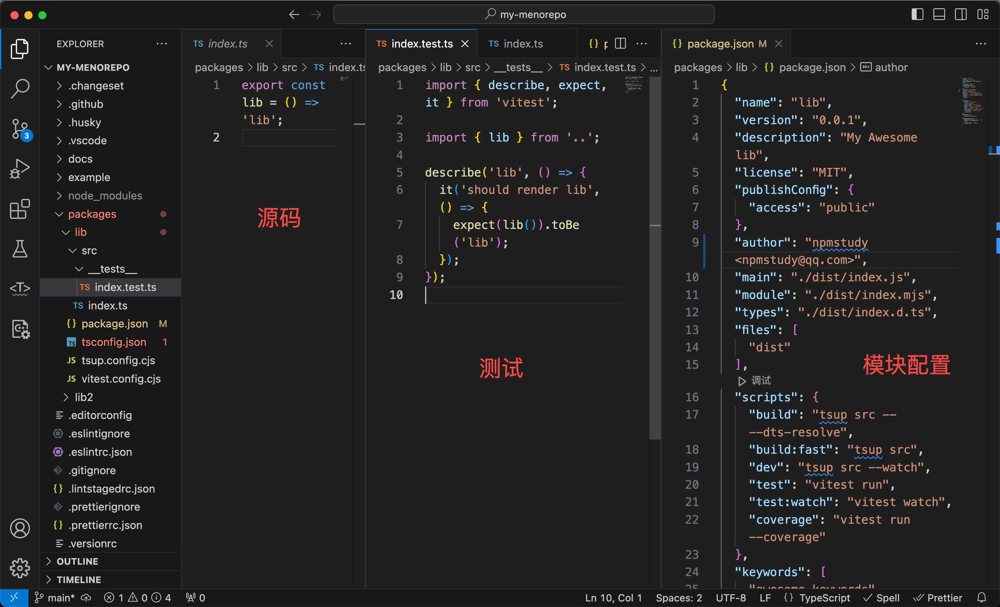

# 开发你的第一个模块

## 初始化

```tsx
$ git clone --depth 1 git@github.com:npmstudy/your-node-v20-monorepo-project.git my-monorepo
Cloning into 'my-monorepo'...
remote: Enumerating objects: 52, done.
remote: Counting objects: 100% (52/52), done.
remote: Compressing objects: 100% (41/41), done.
remote: Total 52 (delta 2), reused 50 (delta 2), pack-reused 0
Receiving objects: 100% (52/52), 89.56 KiB | 181.00 KiB/s, done.
Resolving deltas: 100% (2/2), done.
```

只克隆最新的代码，无更多git commit记录。

```tsx
$ rm -rf .git/
$ git init
Initialized empty Git repository in /Users/alfred/workspace/npmstudy/my-monorepo/.git/
$ git status
On branch main

No commits yet

Untracked files:
  (use "git add <file>..." to include in what will be committed)
	.changeset/
	.editorconfig
	.eslintignore
	.eslintrc.json
	.github/
	.gitignore
	.husky/
	.lintstagedrc.json
	.prettierignore
	.prettierrc.json
	.versionrc
	.vscode/
	LICENSE
	README.md
	commitlint.config.js
	docs/
	example/
	nx.json
	package.json
	packages/
	pnpm-lock.yaml
	pnpm-workspace.yaml
	tsconfig.json

nothing added to commit but untracked files present (use "git add" to track)
$ git add .
$ git commit -am 'init'
[main (root-commit) 73acfc8] init
 42 files changed, 7061 insertions(+)
 create mode 100644 .changeset/README.md
 create mode 100644 .changeset/config.json
 create mode 100644 .editorconfig
 create mode 100644 .eslintignore
 create mode 100644 .eslintrc.json
 create mode 100644 .github/workflows/ci.yml
 create mode 100644 .github/workflows/release.yml
 create mode 100644 .gitignore
 create mode 100755 .husky/commit-msg
 create mode 100755 .husky/pre-commit
 create mode 100755 .husky/pre-push
 create mode 100644 .lintstagedrc.json
 create mode 100644 .prettierignore
 create mode 100644 .prettierrc.json
 create mode 100644 .versionrc
 create mode 100644 .vscode/extensions.json
 create mode 100644 LICENSE
 create mode 100644 README.md
 create mode 100644 commitlint.config.js
 create mode 100644 docs/.gitignore
 create mode 100644 example/package.json
 create mode 100644 example/src/app.ts
 create mode 100644 example/tsconfig.json
 create mode 100644 example/tsconfig.node.json
 create mode 100644 example/vite.config.cjs
 create mode 100644 nx.json
 create mode 100644 package.json
 create mode 100644 packages/lib/package.json
 create mode 100644 packages/lib/src/__tests__/index.test.ts
 create mode 100644 packages/lib/src/index.ts
 create mode 100644 packages/lib/tsconfig.json
 create mode 100644 packages/lib/tsup.config.cjs
 create mode 100644 packages/lib/vitest.config.cjs
 create mode 100644 packages/lib2/package.json
 create mode 100644 packages/lib2/src/__tests__/index.test.ts
 create mode 100644 packages/lib2/src/index.ts
 create mode 100644 packages/lib2/tsconfig.json
 create mode 100644 packages/lib2/tsup.config.cjs
 create mode 100644 packages/lib2/vitest.config.cjs
 create mode 100644 pnpm-lock.yaml
 create mode 100644 pnpm-workspace.yaml
 create mode 100644 tsconfig.json
```

然后配置你自己的git仓库即可。

## 安装依赖

pnpm是一种包管理工具，类似于npm和Yarn。它的主要特点是使用硬链接和符号链接来共享依赖项，以减少磁盘空间的占用和安装时间。

pnpm的一些优点包括：

1. 磁盘空间占用更小：由于使用硬链接和符号链接来共享依赖项，pnpm可以显著减少每个项目的磁盘空间占用。这对于Monorepo和多个项目共享相同依赖项的情况特别有用。
2. 安装速度更快：由于共享依赖项，pnpm可以在安装过程中跳过重复的依赖项。这可以显著减少安装时间，特别是在多个项目之间共享相同依赖项的情况下。
3. 更少的网络流量：由于共享依赖项，pnpm只需要下载一次每个依赖项，而不是每个项目都下载一次。这可以减少网络流量的消耗，特别是在多个项目之间共享相同依赖项的情况下。
4. 兼容性：pnpm与npm和Yarn的生态系统兼容，并且可以使用它们的配置文件和命令。这使得迁移到pnpm相对容易，而不需要对项目进行大量的更改。

pnpm是一个快速、高效且节省空间的包管理工具，适用于大型项目和Monorepo。

安装pnpm

```tsx
$ npm i -g pnpm

added 1 package in 4s

1 package is looking for funding
  run `npm fund` for details
```

安装依赖

```tsx
$ pnpm i
Scope: all 3 workspace projects
Lockfile is up to date, resolution step is skipped
Packages: +819
++++++++++++++++++++++++++++++++++++++++++++++++++++++++++++++++++++++++++++++++++++++++++++++++++++++++++++++++++++++++++++++++++++++++++++++++++++++++++++++++++++++++++++++++++++++++++++++++++++++++++
Progress: resolved 819, reused 819, downloaded 0, added 819, done
node_modules/.pnpm/nx@16.9.1/node_modules/nx: Running postinstall script, done in 988ms

dependencies:
+ @changesets/cli 2.26.2

devDependencies:
+ @commitlint/config-conventional 17.7.0
+ @size-limit/preset-small-lib 8.2.6
+ @types/node 18.17.9
+ @typescript-eslint/eslint-plugin 5.62.0
+ @typescript-eslint/parser 5.62.0
+ commitlint 17.7.1
+ concurrently 8.2.1
+ eslint 8.47.0
+ eslint-config-prettier 8.10.0
+ eslint-import-resolver-typescript 3.6.0
+ eslint-plugin-import 2.28.1
+ eslint-plugin-prettier 4.2.1
+ eslint-plugin-react 7.33.2
+ eslint-plugin-react-hooks 4.6.0
+ husky 8.0.3
+ lint-staged 13.3.0
+ nx 16.9.1
+ prettier 2.8.8
+ size-limit 8.2.6
+ tsup 7.2.0
+ tsx 3.12.10
+ typescript 4.9.5
+ vite 4.4.9
+ vitest 0.32.4

. prepare$ husky install
│ husky - Git hooks installed
└─ Done in 148ms
Done in 5.6s

```

## 目录结构

```tsx
$ tree . -L 4 -I node_modules
.
├── LICENSE
├── README.md
├── commitlint.config.js
├── docs
├── example
│   ├── package.json
│   ├── src
│   │   └── app.ts
│   ├── tsconfig.json
│   ├── tsconfig.node.json
│   └── vite.config.cjs
├── nx.json
├── package-lock.json
├── package.json
├── packages
│   ├── lib
│   │   ├── package.json
│   │   ├── src
│   │   │   ├── __tests__
│   │   │   └── index.ts
│   │   ├── tsconfig.json
│   │   ├── tsup.config.cjs
│   │   └── vitest.config.cjs
│   └── lib2
│       ├── package.json
│       ├── src
│       │   ├── __tests__
│       │   └── index.ts
│       ├── tsconfig.json
│       ├── tsup.config.cjs
│       └── vitest.config.cjs
├── pnpm-lock.yaml
├── pnpm-workspace.yaml
└── tsconfig.json

10 directories, 24 files
```

该项目包含3个子项目，具体如下。

1. packages 是pnpm-workspace.yaml中配置的目录
    1. lib是示例模块
    2. lib2是示例模块
2. example是示例目录

## 模块代码

目录结构

```tsx
$ tree packages/lib/ -I node_modules
packages/lib/
├── package.json
├── src
│   ├── __tests__
│   │   └── index.test.ts
│   └── index.ts
├── tsconfig.json
├── tsup.config.cjs
└── vitest.config.cjs

2 directories, 6 files
```

具体代码



要点说明。

1. 采用了Vitest作为测试框架，这是因为它不依赖Node.js版本
2. 在package.json里没有配置type=module，而是支持cjs和esm二种格式。
3. 采用tsup进行构建
    1. build：生成dts
    2. build:fast：不生成dts

这是对大家比较陌生的可能是Vitest。

Vitest是一个基于Vite的单元测试框架，它具有以下优点：

1. 快速：Vitest被设计为高效的单元测试框架，能够快速执行测试用例。它利用Vite的快速构建能力和热重载功能，提供了快速的测试反馈。
2. 简单易用：Vitest提供了简洁的API和清晰的文档，使得编写和运行测试用例变得简单易懂。它与Vite的生态系统紧密集成，可以无缝地与现有的Vite项目集成。
3. 强大的功能：Vitest支持常见的单元测试功能，包括断言、测试套件、测试组织和测试覆盖率等。它还提供了丰富的扩展性，可以根据项目的需求进行自定义配置和扩展。
4. 社区支持：Vitest是一个开源项目，拥有活跃的社区支持。你可以在GitHub上找到其代码库，并参与讨论、提问问题或贡献代码。

它个快速、简单易用且功能强大的单元测试框架，适用于使用Vite构建的项目。它和Node.js test runner很像，你可以通过阅读文档和示例来了解更多关于Vitest的信息，并开始在你的项目中使用它。

<aside>
💡 学会一门，其他就会触类旁通，这是学习的好处。

</aside>

## 示例

目录

```tsx
$ tree example/ -I node_modules
example/
├── package.json
├── src
│   └── app.ts
└── tsconfig.json

1 directory, 3 files
```

这里以koa为例

```tsx
import Koa from 'koa';
import { lib } from 'lib2';
const app = new Koa();

app.use(async (ctx) => {
  ctx.body = `Hello ${lib()}`;
});

app.listen(3000);
```

执行

```tsx
$ pnpm example

> your-node-v20-monorepo-project@ example /Users/alfred/workspace/npmstudy/my-monorepo
> npm run build && pnpm -F example dev

> build
> nx run-many -t build

    ✔  nx run lib2:build  [existing outputs match the cache, left as is]
    ✔  nx run lib:build  [existing outputs match the cache, left as is]

 ——————————————————————————————————————————————————————————————————————————————————————————————————————————————————————————————————————————————————————————————————————————————————————————————————————————

 >  NX   Successfully ran target build for 2 projects (26ms)

   Nx read the output from the cache instead of running the command for 2 out of 2 tasks.

> example@1.0.0 dev /Users/alfred/workspace/npmstudy/my-monorepo/example
> tsx watch src/app.ts
```

要点：

- 先构建lib和lib2
- 然后tsx watch src/app.ts

此时访问[http://127.0.0.1:3000/](http://127.0.0.1:3000/)


其实，在这种Node.js Server应用里，也是可以进行测试的，比如使用supertest测试api和页面，甚至如果想极致一点，也可以使用Cypress做e2e测试。

这是从简，并没有加，如果大家感兴趣，可以作为课后练习。

## 新增模块

如果想新增一个模块，那就通过简单的shell命令就可以了。

```tsx
$ cp -rf packages/lib packages/lib3
```

查看packages下内容，会发现多了lib3

```tsx
$ tree packages/ -L 2
packages/
├── lib
│   ├── dist
│   ├── node_modules
│   ├── package.json
│   ├── src
│   ├── tsconfig.json
│   ├── tsup.config.cjs
│   └── vitest.config.cjs
├── lib2
│   ├── dist
│   ├── node_modules
│   ├── package.json
│   ├── src
│   ├── tsconfig.json
│   ├── tsup.config.cjs
│   └── vitest.config.cjs
└── lib3
    ├── dist
    ├── node_modules
    ├── package.json
    ├── src
    ├── tsconfig.json
    ├── tsup.config.cjs
    └── vitest.config.cjs

12 directories, 12 files
```

这样其实已经很简单了。如果大家想做更多工程化内容，可以自己写一个脚手架。

技术栈推荐。

1. cli解析，推荐使用commander或cac
2. 输入项，推荐使用 [https://www.npmjs.com/package/inquirer](https://www.npmjs.com/package/inquirer)
3. 模版引擎推荐使用handlebars
4. 可以[**download-git-repo](https://www.npmjs.com/package/download-git-repo) 或** [https://www.npmjs.com/package/dclone](dclone).

<aside>
💡 在前端开发中，脚手架是一个用于快速搭建项目结构和提供初始配置的工具。它可以帮助开发者快速创建项目，并集成了一些常用的工具、库和最佳实践。

</aside>
